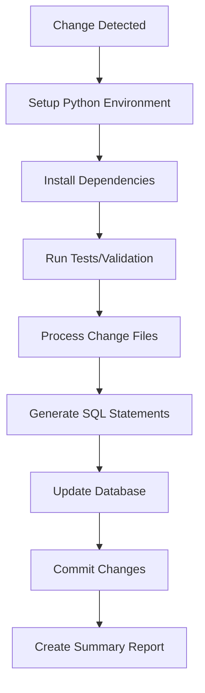

# GitHub Actions CI/CD Setup for PCM Stats Management

This directory contains GitHub Actions workflows that automate the processing of PCM (Pro Cycling Manager) statistics changes. The workflows can read files from the repository, process them using custom Python functions, and commit changes back to the repository.

## 🚀 Features

- **Automated Processing**: Automatically processes new YAML change files
- **Database Management**: Creates and updates SQLite tracking databases
- **SQL Generation**: Generates INSERT statements for database updates  
- **Smart Triggers**: Only runs when relevant files change
- **Error Handling**: Comprehensive error reporting and logging
- **Testing**: Validates code quality and runs tests
- **Manual Triggers**: Can be run manually with custom parameters

## 📁 Workflow Files

### `process-changes.yml` (Main Workflow)
- **Triggers**: Push to main/develop, PRs, manual dispatch
- **Purpose**: Automated processing of change files and SQL generation
- **Features**: 
  - Processes new YAML files in `src/changes/`
  - Generates SQL INSERT statements
  - Commits results back to repository
  - Runs tests for validation
  - Smart change detection using dedicated scripts
  - PR comments with processing summaries

## 🛠️ Setup Instructions

### 1. Prerequisites
- Python 3.8+ environment
- Required Python packages (see `requirements.txt`)
- SQLite database schema file (`src/models/tracking_schema.sql`)

### 2. Repository Configuration
1. **Copy workflow files** to your repository's `.github/workflows/` directory
2. **Ensure proper permissions** in your repository settings:
   - Go to Settings → Actions → General
   - Set "Workflow permissions" to "Read and write permissions"
   - Enable "Allow GitHub Actions to create and approve pull requests"

### 3. Required Repository Structure
```
your-repo/
├── .github/workflows/           # GitHub Actions workflow
├── src/
│   ├── changes/                # YAML change files
│   ├── models/
│   │   ├── api.py              # Database processing functions
│   │   ├── tracking_schema.sql          # Database schema
│   │   └── tracking_db/        # SQLite databases (auto-created)
│   └── utils/
│       └── commons.py          # Common utilities
├── scripts/
│   ├── process_changes.py      # Main processing script
│   ├── workflow_utils.py       # Workflow utility functions
│   └── test_local_ci.py        # Local testing script
├── tests/                      # Test files
└── requirements.txt            # Python dependencies
```

## 🔧 Configuration Options

### Environment Variables
The workflow uses these environment variables (automatically set):
- `GITHUB_TOKEN`: Automatically provided by GitHub Actions

### Manual Workflow Inputs
The workflow supports manual triggers with the workflow_dispatch event.

## 📋 How It Works

### Automatic Triggering
1. **File Changes**: Workflows trigger when files in `src/changes/` or `src/**/*.py` are modified
2. **Change Detection**: Smart detection only processes when relevant changes are found
3. **Processing**: Runs custom Python functions to process YAML files
4. **Database Updates**: Creates/updates SQLite tracking databases
5. **SQL Generation**: Generates INSERT statements for manual review
6. **Commits**: Automatically commits generated files back to repository

### Processing Flow


## 🧪 Local Testing

Before pushing changes, you can test the CI/CD process locally:

```bash
# Run local testing script
python scripts/test_local_ci.py

# Or test individual components
python scripts/process_changes.py
```

The local testing script will:
- Validate workflow YAML syntax
- Create sample test data
- Simulate the GitHub Actions environment
- Run your processing functions locally

## 📊 Monitoring and Debugging

### GitHub Actions Interface
1. Go to your repository's **Actions** tab
2. Select a workflow run to view details
3. Expand job steps to see detailed logs
4. Download artifacts for offline analysis

### Logs and Artifacts
- **Processing Logs**: Detailed execution logs
- **Summary Files**: JSON summaries of processing results
- **Generated Files**: SQL statements and database files
- **Error Reports**: Stack traces and error details

### Common Issues and Solutions

#### 1. Import Errors
```
Import "models.api" could not be resolved
```
**Solution**: This is expected in the IDE. The imports work correctly in the GitHub Actions environment.

#### 2. Permission Denied
```
remote: Permission to user/repo.git denied
```
**Solution**: Check repository settings → Actions → General → Workflow permissions

#### 3. Database Lock Errors
```
database is locked
```
**Solution**: The workflow creates backups and handles database locking automatically

#### 4. No Changes Detected
**Solution**: Ensure your YAML files are in `src/changes/` and follow the expected format

## 🔄 Customization

### Adding New Processing Steps
1. Modify `scripts/process_changes.py` to add custom logic
2. Update workflow files to include additional steps
3. Add any new dependencies to `requirements.txt`

### Custom Triggers
Add new trigger conditions to workflow files:
```yaml
on:
  push:
    paths:
      - 'your-custom-path/**'
  schedule:
    - cron: '0 0 * * 0'  # Weekly on Sunday
```

### Environment-Specific Processing
Use conditional logic in workflows:
```yaml
- name: Production Processing
  if: github.ref == 'refs/heads/main'
  run: python scripts/production_process.py

- name: Development Processing  
  if: github.ref == 'refs/heads/develop'
  run: python scripts/dev_process.py
```

## 📚 Additional Resources

- [GitHub Actions Documentation](https://docs.github.com/en/actions)
- [Workflow Syntax Reference](https://docs.github.com/en/actions/using-workflows/workflow-syntax-for-github-actions)
- [Secrets and Environment Variables](https://docs.github.com/en/actions/security-guides/encrypted-secrets)

## 🤝 Contributing

When contributing to the CI/CD workflows:
1. Test changes locally first using `scripts/test_local_ci.py`
2. Use descriptive commit messages for workflow changes
3. Document any new configuration options
4. Update this README if adding new features

## 📞 Support

If you encounter issues with the CI/CD setup:
1. Check the Actions logs for detailed error messages
2. Review the workflow YAML syntax
3. Ensure all required files and directories exist
4. Verify repository permissions are correctly configured
