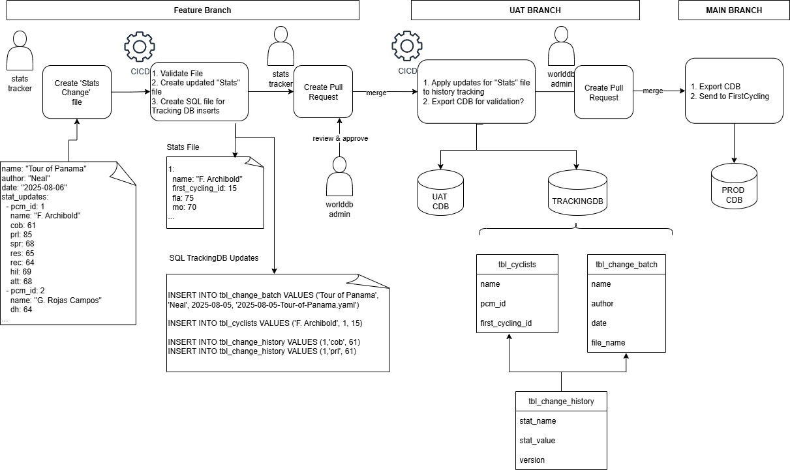

# pcm-stats-management
Manage WorldDB stats by updating, reviewing, and merging stats

Desired Features:

- Allow members to make changes to stats and allow for others to review and approve changes
- Maintain history of changes to stats. 
- Integrate with FirstCycling.com
  - Fetch new cyclist ids
  - Send final database state to FC.com (currently via MySQL .sql DML file)

Design:

- Stat Update requests are initiated by creating a file saved under "src/updates" folders in a YAML configuration file. A discord message can get sent once the branch is created.
- The update request files are created in a Feature branch and a Pull Request (PR) will be created to merge the change into the UAT branch.
- Once the Pull Request is created, other WorldDB members can review and make changes to the update file.
- Once approved the PR is merge into the UAT branch where these steps occcur:
  - The update is applied to a global stats file. 
  - An internal database (non PCM database) tracks changes to the stats and the changes will create records in the database for each stat change
- Once these changes get applied a PR can be created to merge into the Main branch where these steps occur
  - Apply global stats file to PCM Database
  - Export the PCM Database as CDB
  - First Cycling integration
- The internal database can be queried to find the history of changes to individual stats and locate the update file that created the change.

